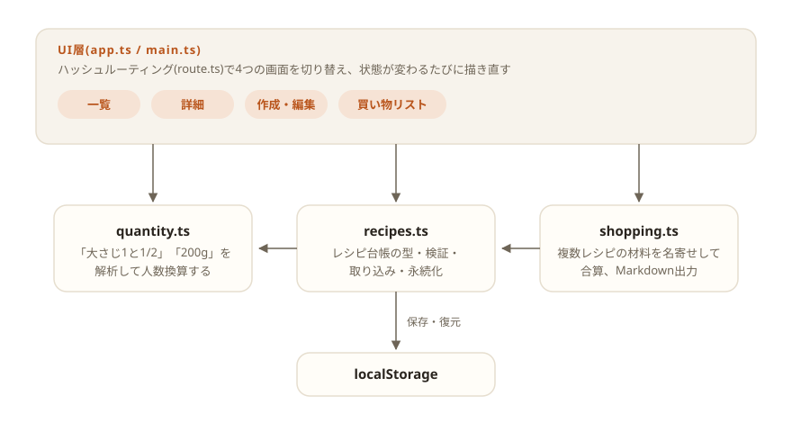

# daidokoro

[](https://github.com/miruky/daidokoro/actions/workflows/ci.yml)
[](https://github.com/miruky/daidokoro/actions/workflows/deploy.yml)

[](LICENSE)

**レシピを登録して人数に合わせて分量を換算し、複数レシピの材料をまとめた買い物リストを作るアプリ。**

公開ページ: https://miruky.github.io/daidokoro/

## 概要

daidokoroは台所で使うことだけを考えたレシピ帳である。レシピは「材料名 分量」を1行ずつ書くだけで登録でき、詳細画面で人数を増減すると「大さじ1と1/2」「200g」のような日本語の分量表記のまま換算される。今日作るレシピを何品か選ぶと、共通の材料を名寄せして合算した買い物リストができあがり、Markdownとしてコピーまたはダウンロードして持ち出せる。

データはすべてブラウザのlocalStorageに保存され、サーバーには何も送らない。アカウント登録も同期もない代わりに、開いた端末の中だけで完結する。

### なぜ作ったのか

レシピサイトの分量換算は「2人前」「4人前」の切り替えしかないことが多く、3人前を作りたいときは結局自分で計算することになる。また、複数の料理を1度の買い物でまとめるとき、醤油やみりんのような共通材料を足し合わせる作業は毎回頭の中でやり直しになる。「表記のまま換算する」「材料を名寄せして合算する」という2つの計算を肩代わりするために作った。

## アーキテクチャ



UI層はフレームワークなしのTypeScriptで、状態が変わるたびに現在の画面を描き直す。分量の解析・換算、レシピ台帳の管理、買い物リストの合算はそれぞれ独立したモジュールで、DOMに依存しないためそのまま単体テストできる。

## 技術スタック

| カテゴリ             | 技術                           |
| :------------------- | :----------------------------- |
| 言語                 | TypeScript 5(strict)           |
| ビルド               | Vite 6                         |
| テスト               | Vitest                         |
| リンタ・フォーマッタ | ESLint 9 / Prettier            |
| CI / 配信            | GitHub Actions / GitHub Pages  |
| 永続化               | localStorage(外部サービスなし) |

## 使い方

### 分量の換算

材料の分量は表記のまま解析され、人数の比率をかけて再び自然な表記に戻される。2人前のレシピを3人前(1.5倍)にした場合の例:

| 入力           | 出力           |
| :------------- | :------------- |
| `200g`         | `300g`         |
| `大さじ1`      | `大さじ1と1/2` |
| `1/2本`        | `3/4本`        |
| `1個`          | `1と1/2個`     |
| `適量`・`少々` | そのまま       |

gやmlのような連続量は数値で丸め、個数やさじは1/4刻みの分数に寄せる。「適量」「ひとつまみ」のような数えられない表記には手を付けない。

### 買い物リスト

買い物リスト画面で作るレシピと人数を選ぶと、材料名で名寄せして合算する。例えば肉じゃが(醤油 大さじ2)と生姜焼き(醤油 大さじ2)を選ぶと「醤油 大さじ4」になる。単位が揃わない場合は無理に変換せず「200g + 1個」のように併記する。できあがったリストはチェックボックス付きMarkdownとしてコピー・保存できる。

```markdown
# 買い物リスト

- [ ] じゃがいも 3個
- [ ] 醤油 大さじ4
- [ ] 豚ロース薄切り肉 300g
```

### 制約

- 名寄せは材料名の完全一致で行う。「ねぎ」と「長ねぎ」は別の品目になる。
- 「大さじ」と「ml」のような単位間の換算はしない(併記に留める)。
- データは端末のブラウザに保存されるため、端末をまたいだ同期はできない。

## プロジェクト構成

- `index.html` — エントリポイント
- `src/main.ts` — 起動。ストアの初期化と初回の見本データ投入
- `src/app.ts` — 画面の描画と遷移(一覧・詳細・編集・買い物リスト)
- `src/icons.ts` — 線画SVGアイコン
- `src/style.css` — デザイントークンとスタイル(ライト・ダーク対応)
- `src/lib/quantity.ts` — 分量表記の解析・換算・整形
- `src/lib/recipes.ts` — レシピの型・検証・行形式の取り込み・永続化
- `src/lib/shopping.ts` — 材料の名寄せ・合算とMarkdown出力
- `src/lib/route.ts` — ハッシュルーティング
- `src/lib/seed.ts` — 初回起動時の見本レシピ
- `docs/architecture.svg` — 構成図
- `.github/workflows/` — CI(lint・テスト・ビルド)とPagesデプロイ

## はじめ方

### 前提条件

- Node.js 22以上

### セットアップ

```bash
git clone https://github.com/miruky/daidokoro.git
cd daidokoro
npm install
npm run dev
```

### テストの実行

```bash
npm test
```

### Lintの実行

```bash
npm run lint
```

### ビルド

```bash
npm run build
```

GitHub Pagesではリポジトリ名のサブパスで配信されるため、デプロイ時は環境変数 `DAIDOKORO_BASE=/daidokoro/` でViteの `base` を切り替える(`.github/workflows/deploy.yml` 参照)。

## 設計方針

- **ローカルファースト** — 保存先はlocalStorageだけで、ネットワークを一切使わない。台所でスマートフォンを開いたとき、電波に関係なく即座に表示される。
- **表記を壊さない換算** — 分量を数値に正規化して持つのではなく、入力された表記のまま保存し、表示の瞬間に換算する。元のレシピの「大さじ2」が「30ml」に化けることはない。
- **ロジックとDOMの分離** — 換算・名寄せ・検証・ルーティングはすべて純粋関数で、Node環境のVitestでテストする。UI層は描画と入力の受け渡しに徹する。
- **壊れた保存データを握りつぶさない設計** — localStorageの復元時は要素単位で検証し、形の崩れた要素だけを読み飛ばす。1件の破損で全件が消えることはない。

## ライセンス

[MIT](LICENSE)
